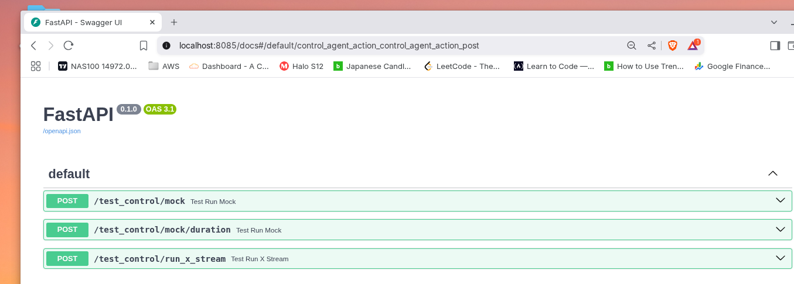

simulates producer messages into ingestion topic 

Included Rest endpoint for 
- generate n number of messages
- generate random messages for the next x amount of time ( float )

---

#### RUN
```
cd ingestion-agent
pdm run uvicorn app.main:app --reload --port 8085
```

```declarative
http://<host>:8085/docs#/default/control_agent_action_control_agent_action_post
```


