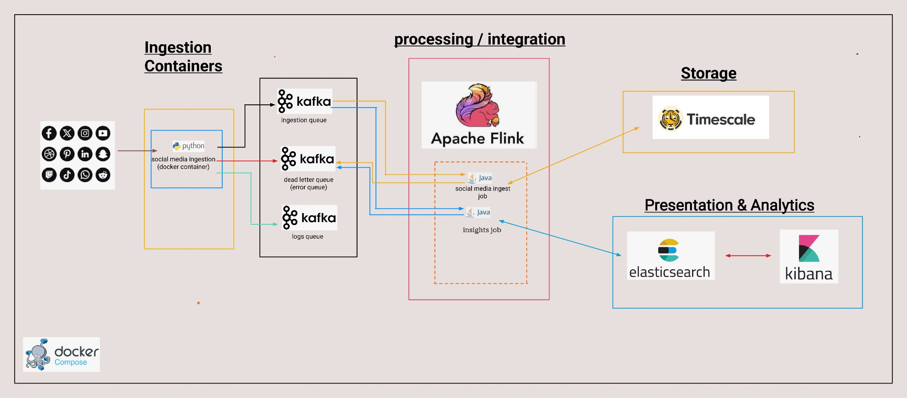
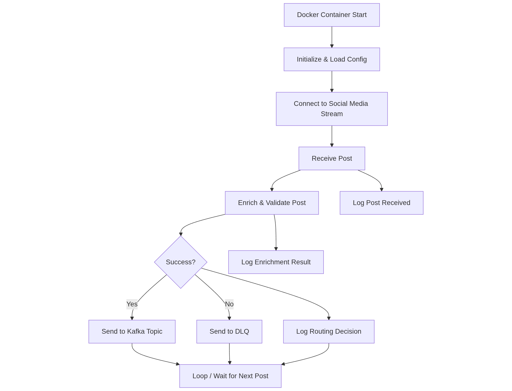
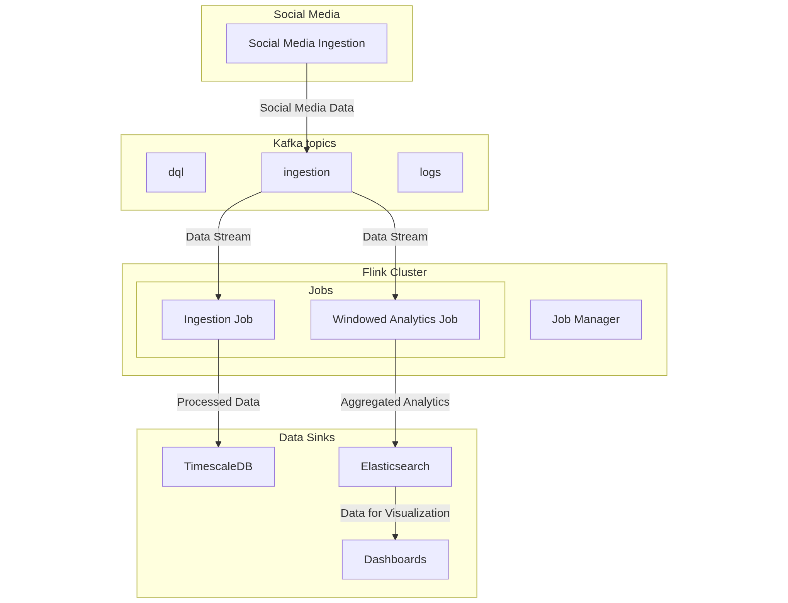

```declarative
Completed
* Ingest simulated data using kafka flink-data stream and populate into timescale DB using flink-sink
* Run 'real time' window aggregation of data from kafka -> flink -> kibana & elastic search

NOT Completed
* Ingest data from file to db, ( took too long working on a parser for Excel )
* Setup scheduled ingestion ( was unable to get docker-compose to properly submit flink job jar )

```


# Flink + Kafka + Elasticsearch + TimescaleDB Stack



This sets up a full data ingestion, streaming, and analytics stack, combining:
- **Docker**
    - Python
- **Apache Flink** for real-time data processing
  - Connectors out of the box
  - Analytics tools
    -  Notebook, SQL, Python, ML ,
  - Con 
    - not ideal for scheduled tasks
    - work around available with in library or external event scheduler
- **Apache Kafka** (with DLQ and multiple brokers) for message queuing
  - Scaling, 
  - Fault tolerance () , 
  - High through 
  - Visibility 
- **Elasticsearch + Kibana** 
  - log storage and visualization
  - Scaling
  - Ease of integration
  - Analytics tools
- **TimescaleDB** 
  - time-series data persistence
- **Kafka UI** 
  - Kafka cluster monitoring

> All services run without persistent storage — ideal for development and testing environments.


### Ingestion Agent logic




### Flink setup high level


---

## Services Overview

| Service              | Description                                  | Ports         |   |
|----------------------|----------------------------------------------|---------------|---|
| Flink JobManager     | Flink master node                            | `8081`        |  	http://localhost:8081 |
| Flink TaskManager    | Flink worker node                            |               |   |
| Zookeeper            | Kafka coordination service                   | `2181`        |   |
| Kafka Ingest         | Primary Kafka broker                         | `9092`, `29092` |   |
| Kafka DLQ            | Dead-letter queue broker                     | `9093`, `29093` |   |
| Kafka Logs           | Logging broker                               | `9094`, `29094` |   |
| Kafka UI             | Web UI for Kafka cluster                     | `8080`        |  	http://localhost:8080 |
| Elasticsearch        | Search and log storage engine                | `9200`        | http://localhost:9200  |
| Kibana               | Visualization layer for Elasticsearch        | `5601`        | 	http://localhost:5601  |
| TimescaleDB          | Time-series database based on PostgreSQL     | `5433`        |   |
| Kafka Setup          | Creates Kafka topics after brokers are ready |               |   |
| mock ingestion agent | Simulates messages                           |               |  http://localhost:8085/docs# |

---

## Getting Started

### Prerequisites

- Docker
- Docker Compose v1.27+ or v2+


### Start All Services

```bash
docker-compose up --build

docker-compose -f ./ingestion-analytics.compose.yml up -d

docker-compose -f ./ingestion-analytics.compose.yml down
 ```
Create this schema in timescaledb ( failed to integrate flyway throw docker compose )

```declarative

create schema sanlam_raw_data_ingest;


CREATE TABLE sanlam_raw_data_ingest.posts (
	traceId TEXT PRIMARY KEY,
	content JSONB,
	agent_meta JSONB,
	date TIMESTAMP
);


CREATE TABLE sanlam_raw_data_ingest.sanctioned_individuals (
    individual_id SERIAL PRIMARY KEY,
    reference_number VARCHAR(100),
    full_name VARCHAR(255),
    listed_on DATE,
    comments TEXT,
    title VARCHAR(100),
    designation VARCHAR(100),
    individual_date_of_birth DATE,
    individual_place_of_birth VARCHAR(255),
    individual_alias VARCHAR(255),
    nationality VARCHAR(100),
    individual_document TEXT,
    individual_address TEXT,
    application_status VARCHAR(50)
);

```